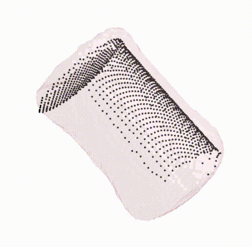

# pc_mesh_show

Simple script to superimpose a point cloud to a mesh with transparency and visualize them with a spin. Written and tested for Python3.

### Example: 

```
pip install --user -r requirements.txt
python main.py --help
python main.py
```

Expected result:

[_You spin me right round, baby \
Right round like a record, baby \
Right round round round_](https://www.youtube.com/watch?v=fpmTe3TDdVU)


